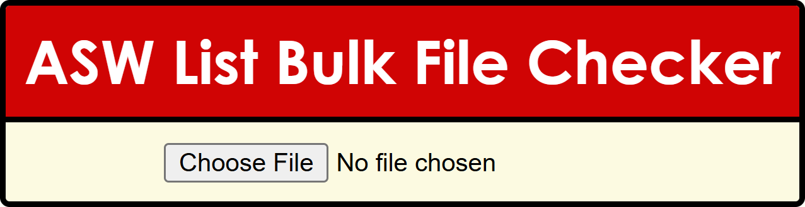

# ASW List Bulk File Checker

This is a small website used to do a rough scan of the .csv/.txt files used for ASW list bulk user adds/removes.

This is only an estimate of what ASW accepts while parsing .csv/.txt files, so please do not take this checker as the truth.

### Known Issues

- Highlighting file text is not supported on all major browsers - [See browser compatibility](https://developer.mozilla.org/en-US/docs/Web/CSS/::highlight#browser_compatibility)
